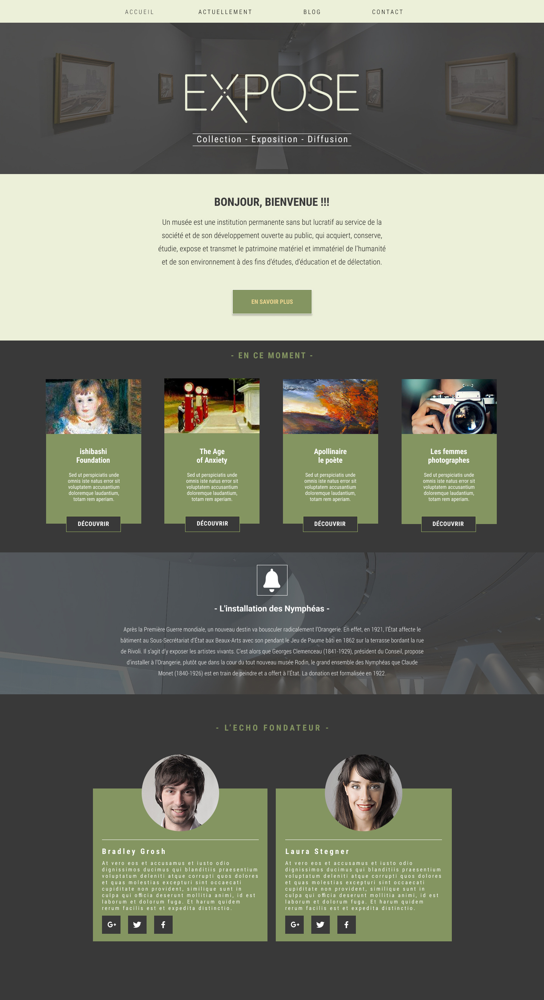

## ECF INTÉGRATION WEB : EXPOSE
Web integration in HTML AND CSS of the EXPOSE model 
Web integration 2 formats:  
You can do the Web integration in Less or in CSS (It's up to you) 
Figma share sent

* PC format
* Tablet format

   

The code must be indented and commented if necessary

Expected result: PC format
&nbsp;&nbsp;

Expected result: Tablet format  
&nbsp;&nbsp;
